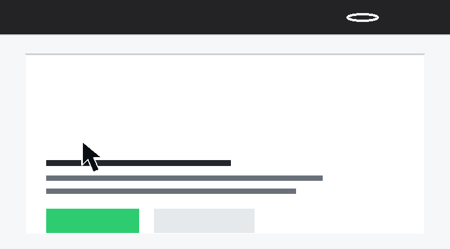

# LidStay

LidStay is a small macOS menu bar app that keeps your Mac awake for a selected time while still allowing the display to sleep.



## Download

Download the latest installer:

```text
https://github.com/ghkdqhrbals/LidStay/releases/latest/download/LidStay.pkg
```

Open `LidStay.pkg` and follow the installer. It installs `LidStay.app` into `/Applications` and the `lidstay` command into `/usr/local/bin`.

## What It Does

- Click the menu bar eye icon to turn Mac keep-awake on or off.
- Pick a duration, or choose `계속 켜두기` to keep it on until you stop it.
- The icon changes between off, on, and keep-on states.
- Display sleep is still allowed, so the screen can turn off normally.
- Battery protection can pause keep-awake below your chosen battery level.
- Login launch, notifications, automatic updates, and in-app removal are available in Options.

Closed-lid behavior can still depend on Mac model, power source, and macOS policy. LidStay uses public macOS power APIs only.

## CLI

LidStay also includes a terminal command for developer workflows:

```bash
lidstay on 2h
lidstay on until-exit npm run dev
lidstay off
lidstay status
lidstay uninstall
```

Duration values support `s`, `m`, and `h`. A plain number is treated as minutes.

## Links

- Homepage: https://ghkdqhrbals.github.io/LidStay/
- Releases: https://github.com/ghkdqhrbals/LidStay/releases/latest
- Product requirements: [docs/PRD.md](docs/PRD.md)

## Build

```bash
xcodebuild -project LidStay.xcodeproj -scheme LidStay -configuration Debug -derivedDataPath .build/DerivedData build
```

The built app is created at:

```text
.build/DerivedData/Build/Products/Debug/LidStay.app
```
